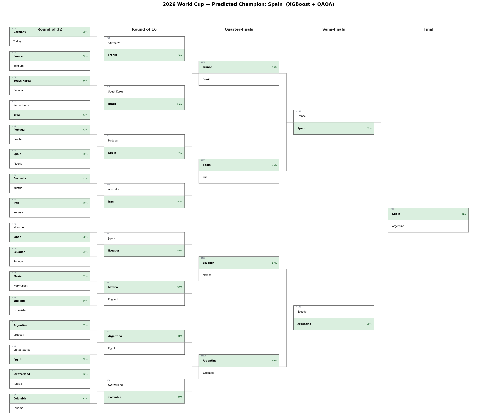
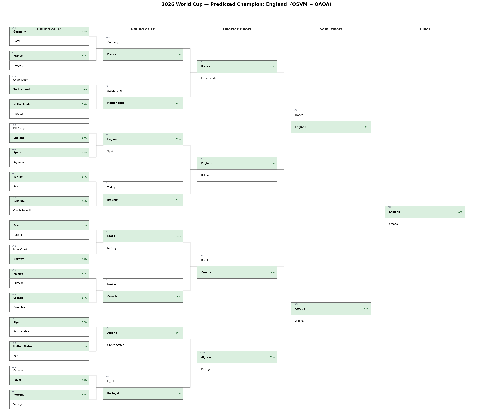

<div align="center">

# ⚛️ Quantum World Cup Predictor

### *Who wins the 2026 FIFA World Cup?*

**A hybrid quantum-classical machine learning system that simulates the entire tournament — group stage to final — and picks the champion.**

[](https://www.python.org)
[](https://qiskit.org)
[](https://xgboost.ai)
[](https://qiskit.org/ecosystem/optimization/)
[](#-license)

</div>

---

## 🎯 The two champions

<table>
<tr>
<th align="center" width="50%">Classical ML + Quantum Optimisation</th>
<th align="center" width="50%">Pure Quantum ML + Quantum Optimisation</th>
</tr>
<tr>
<td align="center">

### 🇪🇸 Spain

*defeats 🇦🇷 Argentina in the final*

**81% confidence**

</td>
<td align="center">

### 🏴󠁧󠁢󠁥󠁮󠁧󠁿 England

*defeats 🇭🇷 Croatia in the final*

**~51% confidence (coin flip)**

</td>
</tr>
<tr>
<td align="center"><sub>Predictor: XGBoost · Bracket: QAOA</sub></td>
<td align="center"><sub>Predictor: QSVM · Bracket: QAOA</sub></td>
</tr>
</table>

> Two genuinely different answers. Read on for *why* — and why the second one is not the one to bet on.

<p align="center">
  
  <br>
  <sub>Hybrid prediction · classical ML for each match, QAOA for the bracket · Spain over Argentina</sub>
</p>

---

## 📖 Why quantum at all?

The whole thing started when I sat down to fill out a 2026 World Cup bracket and did the math: a 32-team knockout has

$$2^{31} = 2{,}147{,}483{,}648 \text{ possible paths through the bracket.}$$

**Over two billion brackets.** You can't enumerate them. You can't brute-force them. You have to *search* them intelligently — and that's exactly the kind of problem quantum computers were built for. Combinatorial optimisation is where algorithms like **QAOA** earn their living, and it's the reason Goldman Sachs, BMW, and Volkswagen all have quantum-optimisation teams working on logistics and finance.

So curiosity took over. Could a quantum computer actually pick the World Cup?

### 🌀 Attempt 1 — Go full quantum

The first version was 100% quantum. A **Quantum Support Vector Machine** (QSVM) predicted every match, and **QAOA** picked the bracket. Six qubits, a real quantum kernel, the whole stack on a Qiskit Aer simulator.

It picked **England**. With 51% confidence in the final. A literal coin flip.

When I evaluated the QSVM on **987 real international matches from 2025** (held out from training), it scored **42.5% accuracy**. Barely above the random-guess baseline for a three-way classifier. The quantum kernel just couldn't discriminate well on this kind of tabular sports data.

It's a known result in the quantum ML literature — quantum kernels often underperform classical models on small tabular datasets — but it lands very differently when it tells you, on your own bracket, that *England is winning the World Cup*.

### ⚛️ Attempt 2 — Hybrid, use each tool for what it's good at

Quantum machine learning struggled. Quantum optimisation didn't. The fix was obvious: stop forcing quantum to do everything.

| Step | Who does it | Why |
|---|---|---|
| **Predict each match** | XGBoost (classical ML) | Tabular data is classical ML's home turf. **57.5%** accuracy on the 2025 holdout — almost **15 points** above the quantum predictor. |
| **Pick the bracket** | QAOA (quantum optimisation) | Searching through 65,536 R32 winner-combinations is combinatorial — quantum's home turf. |

The hybrid system picks **🇪🇸 Spain over 🇦🇷 Argentina** with **81%** confidence in the final.

<div align="center">

> ### *Classical ML predicts each match. Quantum optimisation picks the bracket.*

</div>

---

## 🏟️ See the full predictions

A **self-contained interactive site** lives at [`outputs/index.html`](outputs/index.html). Open it directly with any browser — no server, no install, all data embedded:

```bash
open outputs/index.html
```

The site shows, side by side for both models:

- 🟢 **Group stage** — all 12 groups, expected points / goals for / goals against per team, colour-coded for who advances (top 2 + 8 best third-placed teams)
- 🟡 **Best third-place qualifiers** — which 8 of 12 third-placed teams make the Round of 32
- 🔵 **Knockout bracket** — every match from R32 through the Final, winners highlighted with the model's confidence and the FIFA match number (M73 → M104)

You can also flip through the matplotlib bracket trees: [`docs/bracket_xgb.png`](docs/bracket_xgb.png) and [`docs/bracket_qsvm.png`](docs/bracket_qsvm.png).

<details>
<summary><b>Show the QSVM bracket alongside the XGBoost one</b></summary>

<p align="center">
  
  <br>
  <sub>Pure quantum prediction · QSVM for each match, QAOA for the bracket · England over Croatia · note the 50–55% confidence on almost every match</sub>
</p>

</details>

---

## 🧠 How it works

```mermaid
flowchart TD
    A[Raw match data<br/>8,000+ international games since 2018] --> B[14-dim feature vector per matchup<br/>ELO gap · form · goals · head-to-head · context]
    B --> C[XGBoost<br/>classical baseline]
    B --> D[QSVM<br/>6 qubits · quantum kernel]
    C --> E[Match probabilities<br/>P(home), P(draw), P(away)]
    D --> E
    E --> F[QAOA<br/>Quantum Approximate Optimisation Algorithm]
    F --> G[Full simulated tournament<br/>Groups · R32 · R16 · QF · SF · Final]

    style D fill:#e3d4f5,stroke:#6929C4
    style F fill:#e3d4f5,stroke:#6929C4
    style C fill:#fde2d4,stroke:#EB6E2D
    style G fill:#d4edda,stroke:#155724
```

### What each piece does, in plain English

**The match predictor** — given two teams, it spits out the odds for who wins or draws. It only sees one match at a time. Two versions exist in this repo:

- **XGBoost** — gradient-boosting decision trees. The workhorse of modern tabular ML.
- **QSVM** — encodes each team's features into a 6-qubit quantum state, then measures the similarity between states using a real quantum kernel.

**QAOA — the bracket strategist.** Once the predictor has spat out odds for every possible match, QAOA looks at *all 16 Round-of-32 matches simultaneously* and picks the single combination of winners that makes the entire round most probable. It does this by encoding the round as a QUBO (Quadratic Unconstrained Binary Optimisation) problem and minimising it with a real quantum algorithm on a Qiskit Aer simulator. Then it does the same for the Round of 16, quarter-finals, semi-finals, and final.

### The 14 features in human terms

Each match becomes a 14-dimensional vector built from history:

| Group | Feature | What it measures |
|---|---|---|
| 💪 **Strength** | ELO gap | In-house ELO rating difference (+65 for home advantage when not neutral) |
| 🔥 **Form** | Last 5 form | W=1, D=0.5, L=0, averaged over last 5 matches |
| | Win rate (last 20) | Long-term form |
| ⚽ **Goals (last 10)** | Avg goals scored | Attacking output per team |
| | Avg goals conceded | Defensive solidity per team |
| 🤝 **Head-to-head** | H2H score (last 5) | Result history from home team's perspective |
| 🗓️ **Context** | Rest days | Days since last match for each team |
| | Neutral flag | 0 = host nation home advantage, 1 = neutral |
| | Tournament weight | World Cup > qualifier > friendly |

Full list lives in [`features/builder.py`](features/builder.py) as `FEATURE_NAMES`.

### Honest scoreboard

Evaluated on **987 international matches from 2025** held out from training:

<div align="center">

| Model | Accuracy ↑ | Log-loss ↓ | Brier ↓ |
|:---:|:---:|:---:|:---:|
| 🌀 **QSVM** (quantum) | 42.5% | 1.08 | 0.65 |
| 🌳 **XGBoost** (classical) | **57.5%** | **0.88** | **0.52** |
| 🎲 *Random guess* | *33.3%* | *—* | *—* |

</div>

Pure quantum machine learning lost. Classical ML still wipes the floor with quantum on this kind of small-scale tabular data. The hybrid setup (classical ML + QAOA) is where quantum actually earns its keep — bracket optimisation is genuinely combinatorial, and that's quantum's home turf.

---

## 🛠️ Setup

Requires **Python ≥ 3.11** and (on macOS) `libomp` for XGBoost.

```bash
brew install libomp                # macOS only
python3.11 -m venv .venv
source .venv/bin/activate
pip install -r requirements.txt
```

---

## ▶️ Run it yourself

```bash
# 1. Download the open international results dataset (~8k matches since 2018)
python -m data.ingest

# 2. Compute ELO ratings across the full history
python -m features.elo

# 3. Build the 14-dim per-match feature matrix
python -m features.builder

# 4. Train the classical baseline (~30s)
python -m models.baseline

# 5. Train the quantum SVM — slow (~15 minutes on the simulator,
#    because the kernel matrix is O(N²) and we compute 399x399 entries).
python -m models.qsvm --cap 400

# 6. Compare both models on held-out 2025 matches
python evaluate.py

# 7. Simulate the 2026 World Cup with each predictor
python predict.py --model xgb  --out outputs/prediction_xgb.json
python predict.py --model qsvm --out outputs/prediction_qsvm.json

# 8. Build the interactive site
python -m web.build_site
open outputs/index.html
```

---

## 📂 Project structure

```
config.py                      # paths, ELO constants, 2026 groups, FIFA bracket
data/
  ingest.py                    # fetch + cache the international results CSV
  db.py                        # SQLite schema + connection helper
features/
  elo.py                       # ELO time-series computation
  builder.py                   # per-match 14-dim feature vector
models/
  baseline.py                  # XGBoost classical baseline
  qsvm.py                      # Quantum SVM (ZZFeatureMap + FidelityQuantumKernel)
  data_loader.py               # train/test split by date
bracket/
  group_stage.py               # round-robin group simulation
  qaoa_optimizer.py            # QAOA per round, COBYLA optimiser on Aer
  runner.py                    # FIFA M73→M104 match tree + 3rd-place assignment
  visualize.py                 # matplotlib bracket-tree renderer
web/
  build_site.py                # generates the self-contained index.html
evaluate.py                    # accuracy / log-loss / Brier on 2025 holdout
predict.py                     # end-to-end tournament simulation
outputs/                       # generated JSON, PNGs, HTML
```

---

## 🔬 Deep dive

<details>
<summary><b>What's actually happening inside the QSVM?</b></summary>

```
StandardScaler → PCA(6) → MinMaxScaler[0, π] → ZZFeatureMap(reps=2) → FidelityQuantumKernel → SVC(precomputed)
```

1. `StandardScaler` on the 14-dim feature vector
2. `PCA → 6` components (one per qubit)
3. `MinMaxScaler` into `[0, π]` so PCA outputs are valid rotation angles
4. `ZZFeatureMap(feature_dimension=6, reps=2, entanglement="linear")` encodes the feature vector into a 6-qubit quantum state
5. `FidelityQuantumKernel` measures state-overlap between every pair of training samples → precomputed kernel (Gram) matrix
6. Multiclass `SVC(kernel="precomputed", probability=True)` for the classifier (with Platt scaling for probability calibration)

Training subsamples to **400 stratified examples** to keep kernel computation tractable on the Aer simulator.

</details>

<details>
<summary><b>What's actually happening inside the QAOA bracket optimiser?</b></summary>

Each knockout round becomes a **QUBO** over binary variables (one per match, `x_i = 1` ↔ team A wins).

- **Linear cost:** `−log P(winner)` from the chosen predictor — rewards picking the more probable team in each match.
- **Quadratic regulariser:** mild toss-up coupling between matches whose winners actually meet in the next round (real FIFA bracket adjacency, not just consecutive indices), so QAOA isn't reducible to independent single-qubit minimisations.

Solved with `QAOA(reps=2, optimizer=COBYLA)` and `MinimumEigenOptimizer` from `qiskit_optimization`, sampler = `AerSampler` (statevector simulator).

</details>

<details>
<summary><b>How does the system handle FIFA's wild-card third-place slots?</b></summary>

FIFA's 2026 bracket has 8 Round-of-32 slots that take *"the third-placed team from one of these five groups"* — for example, slot M74 takes the third-placed team from A, B, C, D, or F. Which one depends on which 8 of 12 third-placed teams actually qualify. FIFA's competition regulations enumerate all **495 possible combinations**.

Instead of hard-coding 495 tables, this project solves it as a **bipartite-matching problem**: 8 qualifying groups need to be assigned to 8 slots such that each slot's allowed source-group set is respected. A greedy assignment from the most-constrained slot first solves it in milliseconds; an exhaustive 8! permutation search is the fallback for pathological cases.

See [`bracket/runner.py`](bracket/runner.py) — `_assign_thirds_to_slots()`.

</details>

<details>
<summary><b>Why only ~14 features — what about xG, injuries, player ratings?</b></summary>

Advanced features (expected goals, injury lists, player valuations, top-scorer availability) would need licensed feeds from FBref, Sofascore, or Transfermarkt. To keep this repo fully open-source, the project sticks to a single open dataset and uses ELO + goal averages as proxies. The PRD documents the full feature wishlist; the implementation uses what's actually available.

</details>

---

## 📊 Data

Single open source:

- **[`martj42/international_results`](https://github.com/martj42/international_results)** — every international football match since 1872. We keep matches from 2018 onwards (~8,000 games).
- Tournament metadata (friendly, qualifier, World Cup, etc.) is parsed from the `tournament` column to weight the ELO K-factor and the tournament-importance feature.

---

## ⚠️ Limitations

- **No real quantum hardware.** Everything runs on the Aer statevector simulator. Six qubits is well inside the simulator's comfort zone, but the kernel matrix is O(N²) which is why training subsamples to 400 games.
- **QSVM gives lower confidence across the board.** The quantum kernel doesn't discriminate well on tabular sports data — most QSVM knockout matches sit in the 50–55% range vs. XGBoost's 65–80%.
- **One-shot simulation, no live updates.** This is a single pre-tournament prediction, not a live bracket-update tool.
- **Advanced features omitted** — xG, injuries, player valuations, top-scorer availability all need licensed feeds.
- **Group draw and bracket structure are hard-coded** in `config.py` (`WC_2026_GROUPS`, `WC_2026_R32`, …, `WC_2026_FINAL`).

---

## 🧰 Stack

Python 3.11 · Qiskit 1.4 · `qiskit-machine-learning` 0.8 · `qiskit-optimization` 0.6 · `qiskit-algorithms` 0.3 · `qiskit-aer` 0.15 · XGBoost · scikit-learn · pandas · SQLite · matplotlib

---

*Built because filling out a World Cup bracket should not be a 2-billion-option guess.*

</div>
